<div align="center">

# SmartLedger

### Intelligent Financial Voucher Classification

*Evidence-driven AI for understanding financial transactions*


Hacktober Fest — Open Source AI Hackathon
Challenge: *VYOM+ — Intelligent Voucher Classification Using Open-Source LLMs*

</div>

## Contents

| | | |
|---|---|---|
| [1. About SmartLedger](#1-about-smartledger) | [8. System Architecture](#8-system-architecture) | [15. Expected Features](#15-expected-features) |
| [2. Problem Statement](#2-problem-statement) | [9. Data Flow](#9-data-flow) | [16. Implementation Approach](#16-implementation-approach) |
| [3. Project Overview](#3-project-overview) | [10. Data Quality, Evidence and Intent Layer](#10-data-quality-evidence-and-intent-layer) | [17. Expected Final Output](#17-expected-final-output) |
| [4. Target Users](#4-target-users) | [11. Confidence, Explainability and Human Review](#11-confidence-explainability-and-human-review) | [18. Future Scope and Scalability](#18-future-scope-and-scalability) |
| [5. Core Objectives](#5-core-objectives) | [12. Voucher Categories](#12-voucher-categories) | [19. Open-Source Dependencies](#19-open-source-dependencies) |
| [6. Selected Open-Source AI Technology](#6-selected-open-source-ai-technology) | [13. Agentic Workflow](#13-agentic-workflow) | [20. Expected Challenges and Mitigation](#20-expected-challenges-and-mitigation) |
| [7. Role of AI](#7-role-of-ai) | [14. Technology Stack](#14-technology-stack) | [Decision Framework](#decision-framework) |
| [MVP Priority](#mvp-priority) | [Why SmartLedger?](#why-smartledger) | [Project Vision](#project-vision) |

> [!IMPORTANT]
> At a glance
>
> - Initial model: Qwen2.5-3B-Instruct. The final lightweight Qwen instruct model is chosen after benchmarking.
> - MVP focus: reliable voucher classification using a classical ML baseline and Qwen-based reasoning.
> - Added incrementally: evidence fusion, conflict resolution and human review, once the baseline pipeline is validated.

## 1. About SmartLedger

SmartLedger is an AI-powered financial intelligence system that analyzes structured transaction data and determines the most appropriate accounting voucher category.

Instead of directly asking an AI model to classify a record, SmartLedger works in three steps:

1. Identifies the evidence inside the transaction (who, what, how much, which direction).
2. Derives the transaction intent, meaning the real financial event behind the record.
3. Combines machine-learning predictions with open-source LLM reasoning.

It classifies a transaction when sufficient evidence exists, and routes uncertain or conflicting cases to a human reviewer.

## 2. Problem Statement

Businesses process thousands of transactions involving purchases, sales, payments, receipts, returns, expenses, payroll, inventory movements, imports, exports, orders and deliveries.

Each transaction must be assigned to the correct voucher category, but:

- A single field or keyword is often insufficient.
- Multiple categories look alike (Purchase vs Sales, Payment vs Advance).
- Records are frequently incomplete or ambiguous.

SmartLedger therefore focuses on five things: prediction, evidence, consistency, uncertainty and human validation.

## 3. Project Overview

SmartLedger converts a raw transaction record into an interpretable representation of the underlying financial event.

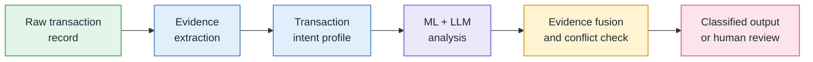

Example intent profile

```
Transaction:   Supplier invoice with item, taxable value and GST
Party flow:    Supplier  →  Business
Goods flow:    Supplier  →  Business
Money flow:    Business  →  Supplier
Tax evidence:  GST present
Other signals: no return reference, no payroll, no import/export
─────────────────────────────────────────────────────────────
Derived intent:  Acquisition of goods from a supplier
Likely voucher:  Purchase
```
## 4. Target Users

- Accountants and finance teams
- Bookkeeping professionals
- Small and medium-sized businesses
- ERP / accounting software providers
- Financial data-processing teams

## 5. Core Objectives

1. Classify transactions into the correct voucher category.
2. Use the complete transaction context, not isolated keywords.
3. Handle incomplete and ambiguous records.
4. Back every prediction with evidence, a confidence level and an explanation.
5. Detect disagreement between AI components and resolve it.
6. Route uncertain cases to human review.
7. Produce machine-readable output.
8. Evaluate honestly on unseen records.

## 6. Selected Open-Source AI Technology

| | |
|---|---|
| LLM | Qwen2.5-3B-Instruct or another lightweight Qwen instruct model selected based on available hardware and benchmark performance |
| Runtime | PyTorch |
| LLM framework | Hugging Face Transformers |
| Classical ML | Scikit-learn |

> [!IMPORTANT]
> Proposed model: Qwen2.5-3B-Instruct is the initial candidate. The final lightweight Qwen instruct model will be selected after benchmarking the criteria below.

| Benchmark criterion | What is compared |
|---|---|
| Inference speed | Time to classify a single record and a batch |
| Output quality | Classification accuracy and valid structured output |
| Memory usage | Memory needed to run the model |
| Available hardware | Fit with the hardware the system will actually run on |

Why an open-source model?

- Privacy: it can run locally, so financial data stays in the user's environment.
- Control: no dependence on a paid proprietary API.
- Flexibility: the model sits behind a clean interface and can be swapped (Gemma, Llama, Mistral and Phi are candidate alternatives).
- Structured output: it can be constrained to return only valid voucher categories in a fixed format.

## 7. Role of AI

SmartLedger uses two complementary AI components. Neither is trusted alone.

| | ML model | Open-source LLM |
|---|---|---|
| Strength | Learns patterns from labeled data, fast, gives probabilities | Understands context and wording, handles unfamiliar patterns |
| Weakness | Struggles with unseen or ambiguous wording | Can be overconfident or produce invalid output |
| Contribution | Prediction and probability | Prediction and reasoning from the intent profile |

The LLM reads the structured transaction context, interprets relationships between fields, selects a category from a constrained list, and explains its reasoning. The ML model gives an independent second opinion. When they agree with strong evidence, the transaction is classified. When they disagree, the system investigates.

## 8. System Architecture

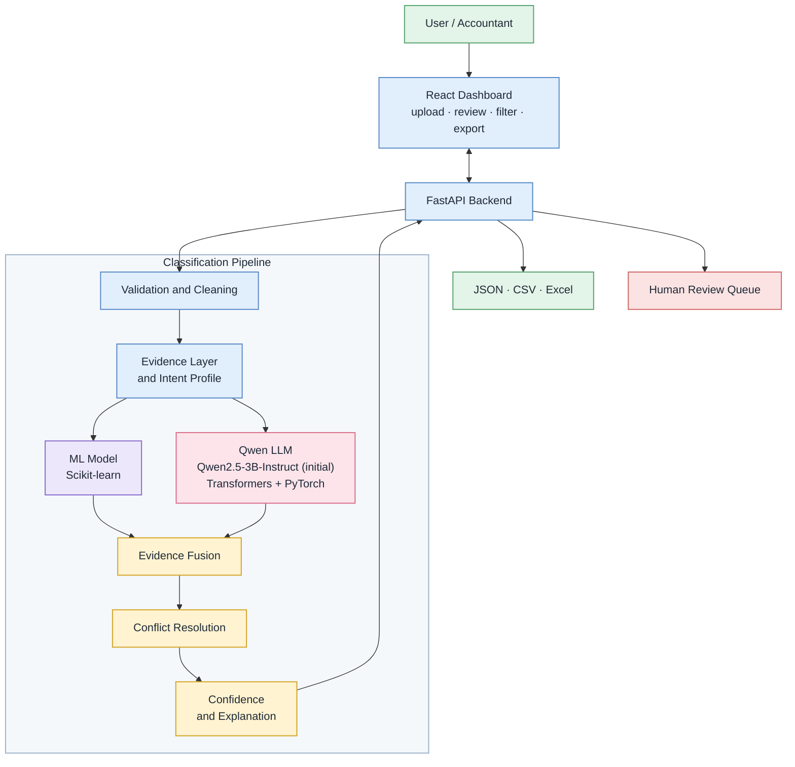

| Layer | Responsibility |
|---|---|
| Interface | Upload, results, review queue, filtering, export |
| API | Receives files, runs the pipeline, returns results |
| Preprocessing | Schema validation, missing values, normalization |
| Evidence layer | Extracts evidence and builds the intent profile |
| Intelligence | ML prediction and LLM reasoning |
| Decision | Fusion, conflict detection, confidence, explanation |
| Output | JSON, CSV, Excel, human review queue |
## 9. Data Flow

1. The user uploads an Excel or CSV file.
2. The system validates the schema and cleans the data.
3. Missing values are handled; categories, numbers and text are normalized.
4. The evidence layer extracts party, money, goods, return, order, import/export, payroll and inventory evidence.
5. A transaction intent profile is generated for each record.
6. The ML model predicts a voucher type with a probability.
7. The Qwen LLM reasons over the intent profile and predicts a voucher type from the valid list.
8. Evidence fusion combines both predictions, the evidence and the data completeness.
9. Conflict resolution handles any disagreement through targeted re-analysis.
10. The record is auto-classified or sent to human review, with confidence and explanation.
11. Results are exported and shown on the dashboard.

## 10. Data Quality, Evidence and Intent Layer

### Data Quality Assessment

Before interpreting a transaction, SmartLedger checks whether the record contains enough usable information.

```mermaid
flowchart LR
    T["Transaction"]:::input --> Q["Data Quality<br/>Assessment"]:::process --> L["High / Medium / Low"]:::decision --> E["Evidence<br/>Extraction"]:::process --> I["Transaction<br/>Intent"]:::output
    classDef input fill:#E3F4E8,stroke:#5BA672,color:#1F2937,stroke-width:1.5px
    classDef process fill:#E1EEFB,stroke:#5B8DC9,color:#1F2937,stroke-width:1.5px
    classDef ml fill:#EDE7FB,stroke:#8C6FCF,color:#1F2937,stroke-width:1.5px
    classDef llm fill:#FCE4EA,stroke:#D9708C,color:#1F2937,stroke-width:1.5px
    classDef decision fill:#FFF3D1,stroke:#D4A72C,color:#1F2937,stroke-width:1.5px
    classDef output fill:#E3F4E8,stroke:#5BA672,color:#1F2937,stroke-width:1.5px
    classDef review fill:#FBE3E3,stroke:#D46A6A,color:#1F2937,stroke-width:1.5px
    classDef good fill:#E3F4E8,stroke:#5BA672,color:#1F2937,stroke-width:1.5px
    classDef step fill:#F5F8FB,stroke:#9DB4CC,color:#1F2937,stroke-width:1.5px
    classDef mvp fill:#E3F4E8,stroke:#2E7D32,color:#1F2937,stroke-width:3px
```

The data-quality result becomes an input to the later confidence and routing stages. A low-quality record should not automatically be treated as a high-confidence prediction.

### Evidence and Intent Layer

This layer is what separates SmartLedger from a plain classifier. It turns raw fields into financial evidence, then into intent.

| Evidence type | The question it answers |
|---|---|
| Party | Who is the supplier or customer, and which way does the relationship run? |
| Money | Is money paid, received, moved between accounts, or not involved? |
| Goods / service | Are goods or services exchanged, and in which direction? |
| Return | Is this a reversal of an earlier sale or purchase (debit / credit note)? |
| Order | Is this a commitment (order) rather than a completed transaction? |
| Import / export | Is there cross-border or foreign-currency activity? |
| Payroll | Does it involve employees, salary or attendance? |
| Inventory | Is stock moving, counted, rejected or sent for job work? |

Why intent matters: two records can share the same amount and a similar description yet represent completely different events. Reasoning about *what happened* is more reliable than matching keywords.

### Voucher Evidence Matrix

The evidence layer can represent which signals support or contradict candidate voucher categories. This creates a transparent intermediate representation between raw transaction fields and AI predictions.

| Evidence | Purchase | Sales | Payment | Receipt |
|---|:---:|:---:|:---:|:---:|
| Supplier → Business | ✓ | — | possible | — |
| Customer → Business | — | — | — | ✓ |
| Goods → Business | ✓ | — | — | — |
| Goods → Customer | — | ✓ | — | — |
| Money → Supplier | possible | — | ✓ | — |
| Money → Business | — | possible | — | ✓ |
| Invoice / item details | ✓ | ✓ | — | — |

The MVP starts with a small set of high-value evidence signals. The matrix can be expanded only when error analysis shows that additional evidence improves classification.

## 11. Confidence, Explainability and Human Review

### Confidence

Confidence is a system-level estimate built from several sources, not a number the LLM reports about itself:

- ML prediction probability
- LLM prediction and its consistency
- Agreement between ML and LLM
- Strength of the transaction evidence
- Completeness of the data

This avoids the overconfidence problem of a single model. Confidence thresholds are tuned on validation data.

### Confidence Calibration

After the baseline confidence mechanism is working, SmartLedger can evaluate whether predicted confidence corresponds to actual correctness using validation data.

Possible measures include:

- Reliability / calibration curves
- Expected Calibration Error (ECE)
- Brier score

Calibration is an incremental reliability feature, not a prerequisite for the first MVP.

### Selective Classification and Abstention

SmartLedger does not have to force a voucher label when the available evidence is insufficient. If the system cannot justify a reliable decision, it can abstain and route the record for review.

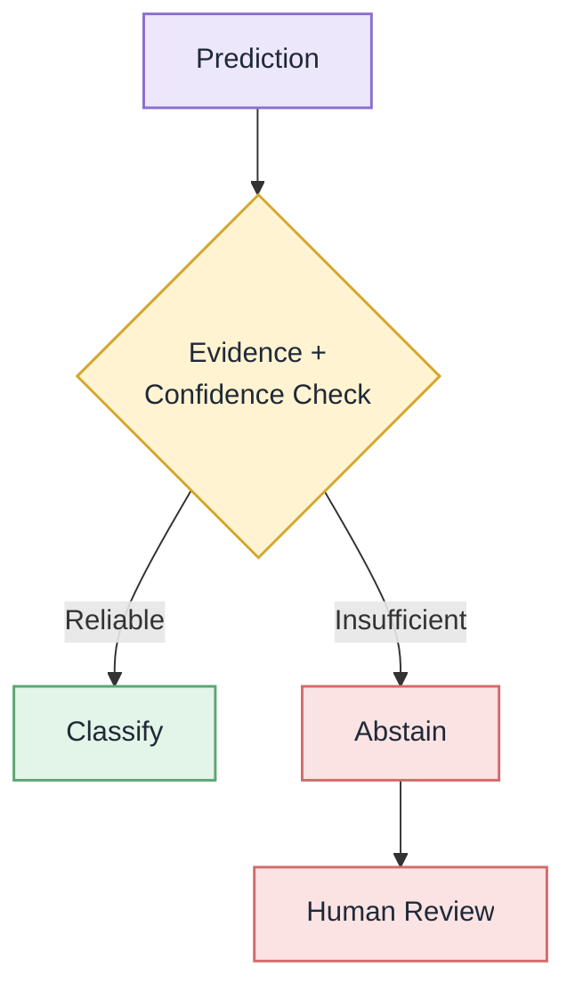

For financial data, an explicit *"insufficient evidence"* decision can be safer than a confident but incorrect classification.

### Routing

| Situation | Action |
|---|---|
| ML and LLM agree, evidence is strong | Automatically classified |
| They disagree, or evidence is weak | Evidence investigation (targeted re-analysis) |
| Conflict resolved | Classified with the resolved result |
| Still unresolved or insufficient evidence | Human review queue |

### Explainability

Every prediction includes the supporting evidence and a short explanation. Review cases also state why the system was unsure (for example: missing party, no goods information, conflicting predictions).

### AI Decision Audit Trail

For each classified transaction, SmartLedger can retain the decision inputs needed to explain and reproduce the result:

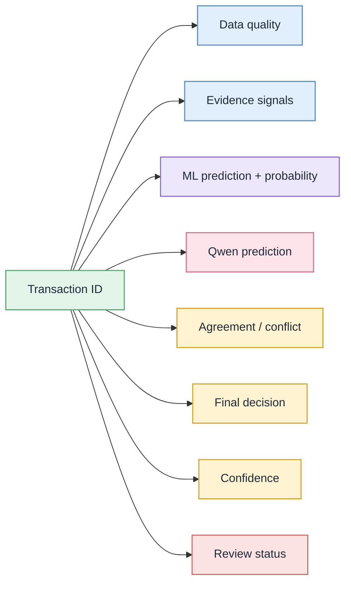

This makes the system useful beyond the hackathon for debugging, audit support, error analysis and model improvement.

### Human in the loop

Reviewers confirm or correct flagged records. Corrections are kept as labeled data for future evaluation and model improvement.

## 12. Voucher Categories

27 supported categories. The validation layer rejects any output outside this set.

| Group | Categories |
|---|---|
| Core accounting | Purchase · Sales · Purchase Return / Debit Note · Sales Return / Credit Note · Payment · Receipt · Contra · Journal |
| Orders and delivery | Purchase Order · Sales Order · Receipt Note · Delivery Note · Rejection In · Rejection Out |
| Inventory and job work | Stock Journal · Physical Stock · Material In · Material Out · Job Work In Order · Job Work Out Order |
| Trade, payroll and other | Import · Export · Expense · Advance / Prepayment · Salary / Payroll · Attendance · Other / Miscellaneous |

## 13. Agentic Workflow

SmartLedger applies selective reasoning: the expensive investigation step runs only when the two AI components do not already agree with high confidence. Easy cases take the fast path; hard cases get extra attention.

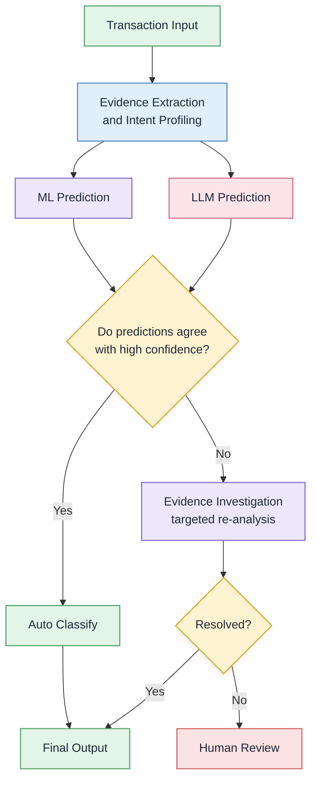

Targeted re-analysis re-examines only the evidence in dispute (for example party direction, a return reference, or payment versus goods flow) instead of re-running everything. This keeps the system efficient on limited hardware.

## 14. Technology Stack

| Area | Technology |
|---|---|
| Open-source AI | Qwen-family LLM (initial candidate: Qwen2.5-3B-Instruct) |
| Machine learning | Scikit-learn |
| Runtime | PyTorch |
| LLM framework | Hugging Face Transformers |
| Data processing | Pandas, NumPy |
| Excel handling | OpenPyXL |
| Backend | Python, FastAPI |
| Frontend | React.js, Tailwind CSS |
| Output formats | JSON, CSV, Excel |
| Development | Git, GitHub |

## 15. Expected Features

- Excel / CSV upload and schema validation
- Transaction preprocessing
- Evidence extraction and transaction intent generation
- ML prediction
- Open-source LLM reasoning
- Evidence fusion and conflict detection
- Confidence estimation
- Data quality scoring
- Voucher evidence matrix
- Selective classification / abstention
- Explainable predictions
- AI decision audit trail
- Hard-negative error analysis
- Human review queue
- Batch classification
- Filtering and export

## MVP Priority

> [!IMPORTANT]
> The first implementation focuses on reliable voucher classification using a classical ML baseline and Qwen-based reasoning. Evidence fusion, conflict resolution and human review are implemented incrementally after the baseline pipeline is validated.

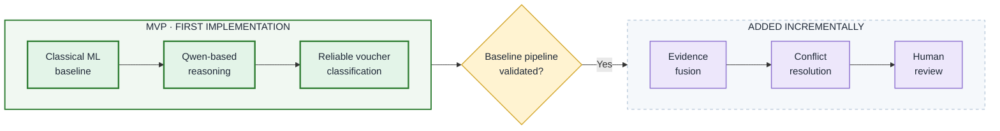

| Stage | What is built | Why this order |
|---|---|---|
| MVP | Classical ML baseline and Qwen-based reasoning for voucher classification | Establishes a reliable, measurable foundation first |
| Incremental | Evidence fusion, conflict resolution and human review | Each layer is added on top of a validated baseline, so its benefit can be measured |

## 16. Implementation Approach

SmartLedger will be developed in a dependency-first sequence. Each stage is validated before the next layer is added. This keeps the project implementable and prevents reliability features from being added before the core classifier is understood.

### Implementation Order

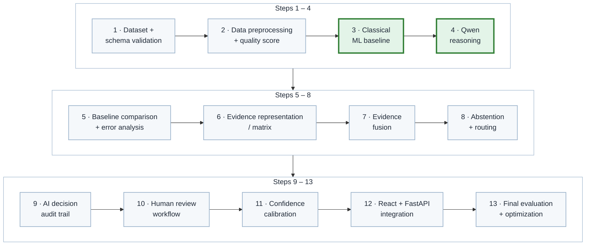

Green-bordered steps (3 and 4) form the MVP.

### MVP Boundary

The first working MVP is:

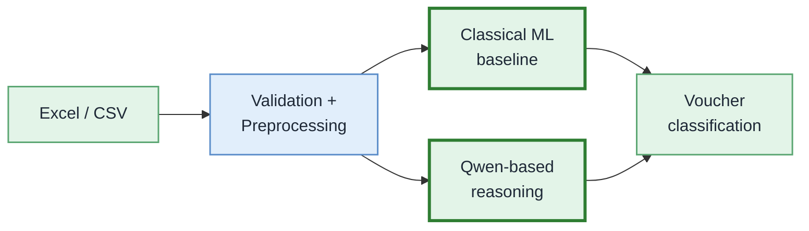

The remaining reliability components are added incrementally after this pipeline is validated.

### Phase Details

| Phase | Focus | Details |
|---|---|---|
| 1. Dataset + schema | Know the data | Fields, voucher distribution, missing values, ambiguous categories, train / validation / test splits |
| 2. Preprocessing + quality | Prepare reliable inputs | Missing values, normalization, text processing, transaction-level features, data-quality score |
| 3. ML baseline `MVP` | Set a benchmark | Evaluate Logistic Regression, Random Forest and XGBoost; select from measured results |
| 4. Qwen reasoning `MVP` | Add semantic reasoning | Integrate the selected lightweight Qwen instruct model with structured transaction context and constrained voucher output |
| 5. Error analysis | Understand failures | Confusion matrix, hard-negative pairs, missing evidence and failure patterns |
| 6. Evidence representation | Make decisions explainable | Evidence extraction and voucher evidence matrix |
| 7. Evidence fusion | Combine signals | ML prediction, LLM prediction, evidence and data quality |
| 8. Abstention + routing | Avoid forced errors | Selective classification, conflict handling and review routing |
| 9. Audit trail | Make decisions traceable | Store evidence, predictions, decision, confidence and review status |
| 10. Human review | Close the loop | Reviewer confirmation/correction and labeled feedback |
| 11. Confidence calibration | Improve trust | Validate whether confidence corresponds to actual correctness |
| 12. Application | Make it usable | React dashboard, FastAPI backend and classification pipeline |
| 13. Final evaluation | Prove it works | Accuracy, Precision, Recall, Macro F1, per-category F1, hard-negative performance, inference time and confidence reliability |

### Error Analysis and Hard-Negative Evaluation

Overall accuracy is not enough for this problem. SmartLedger will explicitly analyze voucher pairs that are easy to confuse, such as:

- Purchase ↔ Payment
- Purchase ↔ Sales
- Purchase Return ↔ Purchase
- Sales Return ↔ Sales
- Purchase Order ↔ Purchase
- Sales Order ↔ Sales

The development loop is:

```mermaid
flowchart LR
    A["Train"]:::step --> B["Evaluate"]:::process --> C["Find Errors"]:::review --> D["Group<br/>Confusions"]:::decision --> E["Identify<br/>Missing Evidence"]:::decision --> F["Improve<br/>Features / Prompt"]:::ml --> G["Re-evaluate"]:::process
    G -.-> C
    classDef input fill:#E3F4E8,stroke:#5BA672,color:#1F2937,stroke-width:1.5px
    classDef process fill:#E1EEFB,stroke:#5B8DC9,color:#1F2937,stroke-width:1.5px
    classDef ml fill:#EDE7FB,stroke:#8C6FCF,color:#1F2937,stroke-width:1.5px
    classDef llm fill:#FCE4EA,stroke:#D9708C,color:#1F2937,stroke-width:1.5px
    classDef decision fill:#FFF3D1,stroke:#D4A72C,color:#1F2937,stroke-width:1.5px
    classDef output fill:#E3F4E8,stroke:#5BA672,color:#1F2937,stroke-width:1.5px
    classDef review fill:#FBE3E3,stroke:#D46A6A,color:#1F2937,stroke-width:1.5px
    classDef good fill:#E3F4E8,stroke:#5BA672,color:#1F2937,stroke-width:1.5px
    classDef step fill:#F5F8FB,stroke:#9DB4CC,color:#1F2937,stroke-width:1.5px
    classDef mvp fill:#E3F4E8,stroke:#2E7D32,color:#1F2937,stroke-width:3px
```

The goal is to improve the system based on real failure cases rather than optimizing a single headline metric.

Evaluation notes. Testing uses unseen records with a stratified split. Because voucher categories are imbalanced, Macro F1 and per-category F1 are the headline metrics. Results are compared across the ML baseline, the LLM alone, and the full SmartLedger pipeline. Confidence reliability checks that high-confidence predictions really are more accurate.

## 17. Expected Final Output

High-evidence transaction

```
Invoice:      INV-2026-1042
Voucher:      Purchase
Confidence:   High
Status:       Automatically Classified
Evidence:     Supplier → Business | Goods → Business | Money → Supplier
Explanation:  Transaction represents acquisition of goods from a supplier.
```

Uncertain transaction

```
Amount:       ₹50,000
Voucher:      Payment
Confidence:   Low
Status:       Needs Human Review
Reason:       Insufficient party, goods and transaction-context information.
```

Machine-readable output

```json
{
  "invoice_number": "INV-2026-1042",
  "voucher_type": "Purchase",
  "confidence": 0.94,
  "status": "auto_classified",
  "evidence": {
    "party_flow": "supplier_to_business",
    "money_flow": "business_to_supplier",
    "goods_flow": "supplier_to_business"
  }
}
```

## 18. Future Scope and Scalability

The reliability features in the implementation plan are part of the core product roadmap. The following items are longer-term extensions after the core system is stable:

- ERP and accounting platform integration
- Continuous learning from human-reviewed transactions
- Domain-specific fine-tuning
- Multilingual transaction understanding
- Advanced agentic workflows
- Semantic embeddings
- Automated voucher creation
- Duplicate transaction detection
- Anomaly detection
- Expense analysis
- Financial reporting
- Audit assistance

## 19. Open-Source Dependencies

| Component | Purpose |
|---|---|
| Qwen-family LLM (initial candidate: Qwen2.5-3B-Instruct) | Contextual transaction reasoning |
| Hugging Face Transformers | LLM loading and inference |
| PyTorch | Model execution |
| Scikit-learn | ML classification and evaluation |
| XGBoost *(if selected in the baseline phase)* | Gradient-boosted ML classifier |
| Pandas | Data processing |
| NumPy | Numerical processing |
| OpenPyXL | Excel processing |
| FastAPI | Backend API |
| React.js | Frontend |
| Tailwind CSS | UI development |

The final implementation will use version-pinned dependencies appropriate for the selected model and deployment environment.

## 20. Expected Challenges and Mitigation

| Challenge | Mitigation |
|---|---|
| Similar voucher categories | Transaction intent and complete-context analysis |
| Missing fields | Data completeness scoring and uncertainty handling |
| ML / LLM disagreement | Conflict detection and targeted re-analysis |
| Class imbalance | Stratified evaluation and class-aware metrics |
| LLM hallucination | Constrained categories and output validation |
| Invalid output | Strict structured-output validation |
| Limited hardware | Lightweight Qwen model (Qwen2.5-3B-Instruct as the initial candidate) or quantized variants |
| Ambiguous transactions | Human-in-the-loop review |
| Unseen patterns | ML and semantic reasoning combination |
| Overconfidence | System-level confidence from multiple evidence sources and later calibration |
| Forced classification | Abstention when evidence is insufficient |
| Difficult class pairs | Hard-negative analysis and evidence-specific improvements |
| Traceability | AI decision audit trail |
| Large datasets | Batch processing and optimized inference |

## Decision Framework

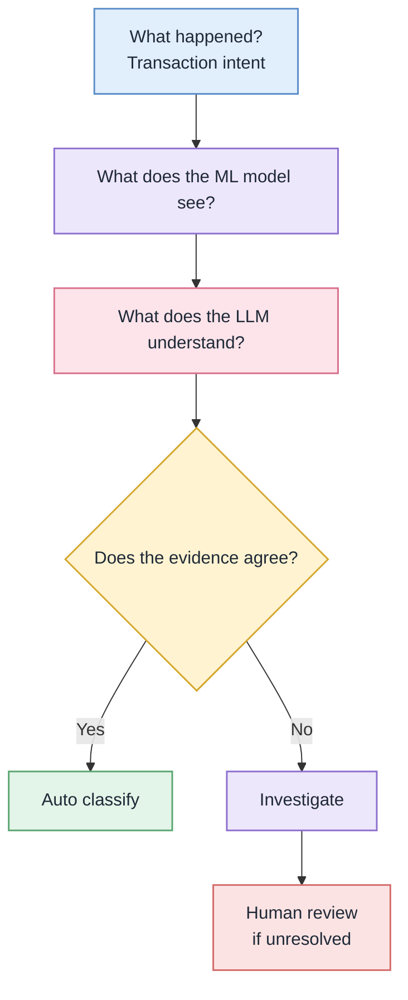
## Why SmartLedger?

A traditional classifier asks:

> *"What class does this record belong to?"*

SmartLedger asks:

> *"What financial event does this record represent, what evidence supports that interpretation, and do our AI systems agree?"*

It combines structured ML, transaction evidence, open-source LLM reasoning, conflict detection and human validation.


## Project Vision

SmartLedger aims to act as an intelligent bridge between raw financial transaction data and automated accounting workflows.
Automate confident decisions. Explain uncertain decisions. Keep humans in control when evidence is insufficient.